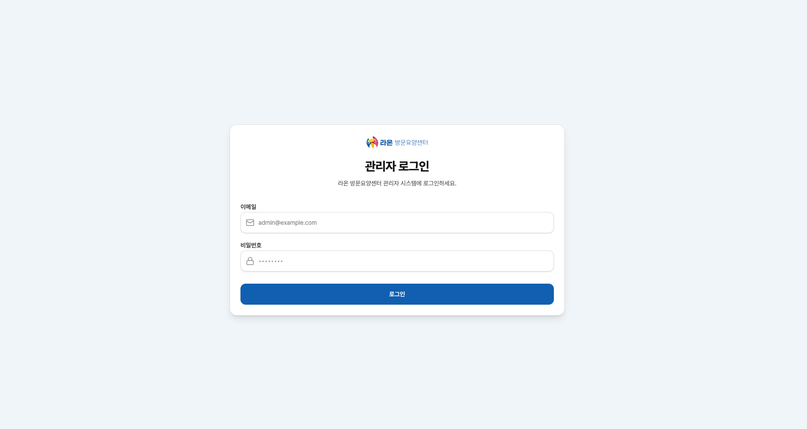
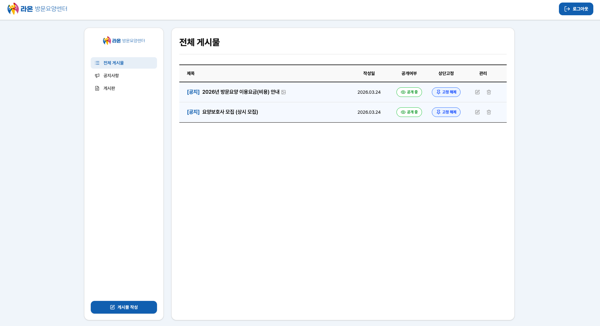
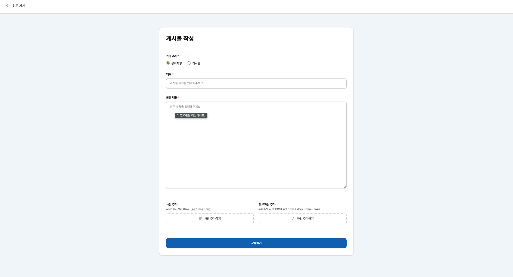
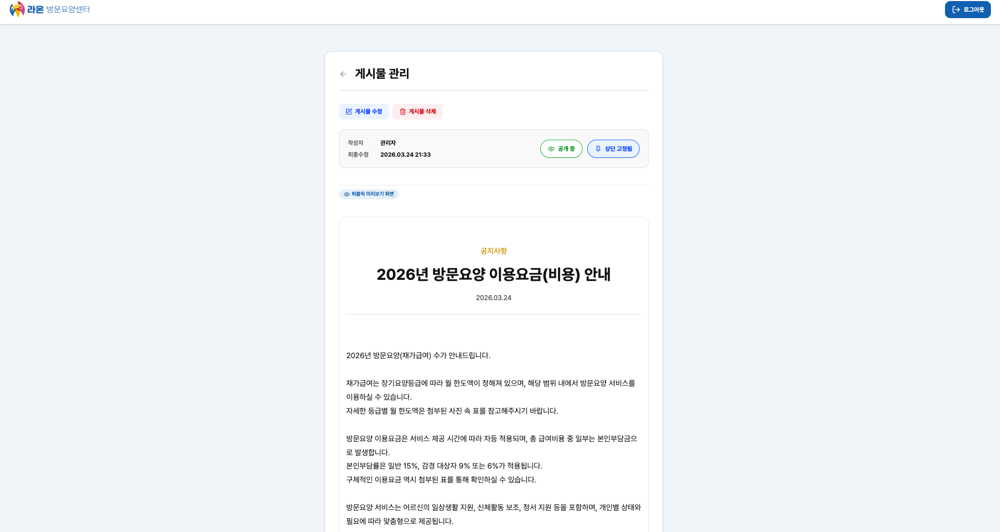

# raon-care-center-portfolio

> 라온방문요양센터 홈페이지 프로젝트 설명 및 실행 화면 정리 레포 (실서비스 링크 포함)\
> 실제 운영 중인 방문요양센터 홈페이지를 외주 의존 구조에서 벗어나기 위해 재구축한 프로젝트입니다.

## 1. 프로젝트 소개

> 2026.03 ~ (진행중)\
> 개인 프로젝트\
> 2026년 4월 24일 기준 배포 완료 후 유지보수 진행중\
> Link: https://www.yesanraon.co.kr/

### 1-1. 문제 정의

기존 외주 홈페이지에서는 다음과 같은 문제 발생

- 센터장이 직접 게시물 등 컨텐츠 관리 불가 (외주 의존 문제)
- 기존 외주 홈페이지 검색엔진 노출 전무

 

**따라서 외주 의존을 없애고 직접 관리할 수 있도록 서비스 자체 개발 및 CMS 서비스를 제작**

### 1-2. 기술 스택

- Next.js (App Router)
- React 19
- TypeScript
- Supabase (PostgreSQL + RLS + Auth + Storage)
- Tailwind CSS

## 2. 주요 기능

### 2-1. 관리자 CMS

- 공지사항 / 게시물 CRUD
- 이미지(최대 10장) 및 문서 파일(최대 5장) 업로드
- 게시글 공개 / 비공개 관리
- 공지사항 상단 고정 기능

센터장이 관리자 아이디로 로그인하여 직접 콘텐츠를 관리할 수 있도록 설계

### 2-2. 공개 페이지 제작

기본적인 센터 소개 공개 페이지 제작

- 홈, 인사말, 공지사항, 게시물, 오시는 길 페이지 존재
- 공지사항 / 게시물 : CMS 에서 공개 설정한 게시물만 보여주도록 설계
- 오시는길 : Naver - Maps 의 Static Map API를 사용하여 센터 근처 지도 사진 확인 가능

### 2-3. SEO 최적화

- `metadata` 및 `generateMetadata`를 활용한 메타데이터 설정
- JSON-LD 구조화 데이터 적용 (Organization, LocalBusiness)
- 동적 sitemap.xml 생성
- 네이버 서치어드바이저 / Google Search Console 등록

## 3. 아키텍처 설계

### 3-1. 기본 설계

- CMS 페이지 접근: **RLS로 허용된 유저만 접근 가능 + 미들웨어에서 세션 검증** 을 통한 이중 보안 설정
- 파일 업로드: 클라이언트 사이드 업로드 구조
  - Client: Canvas API로 브라우저에서 이미지 리사이즈 + WebP 변환 후 Supabase Storage 직접 업로드
  - 서버에서는 업로드 후 url만 DB 저장
- 이미지 접근 : Private 버킷 + Signed URL 조합

### 3-2. Supabase RLS 설계

- 공지사항 / 게시물
  - Admin: CRUD 모두 가능
  - 그 외 사용자 : 퍼블릭 처리된 게시물만 Read 가능
- CMS 로그인 : Admin으로 등록된 이메일만 로그인 가능

## 4. 실행화면

- 공개페이지 화면은 [프로젝트 링크](https://www.yesanraon.co.kr/)를 통해 확인 가능합니다.

| 페이지 설명          | 스크린샷                                      |
| -------------------- | --------------------------------------------- |
| 로그인 페이지        |              |
| 게시물 리스트 페이지 |    |
| 게시물 작성 페이지   |       |
| 게시물 디테일 페이지 |  |
